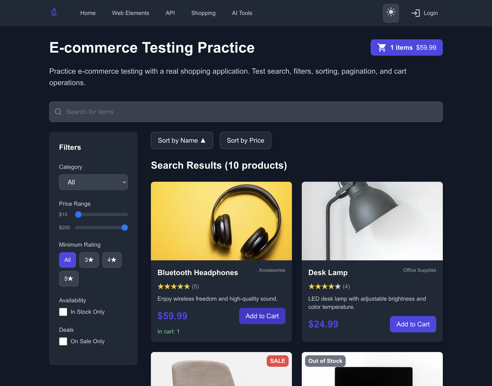
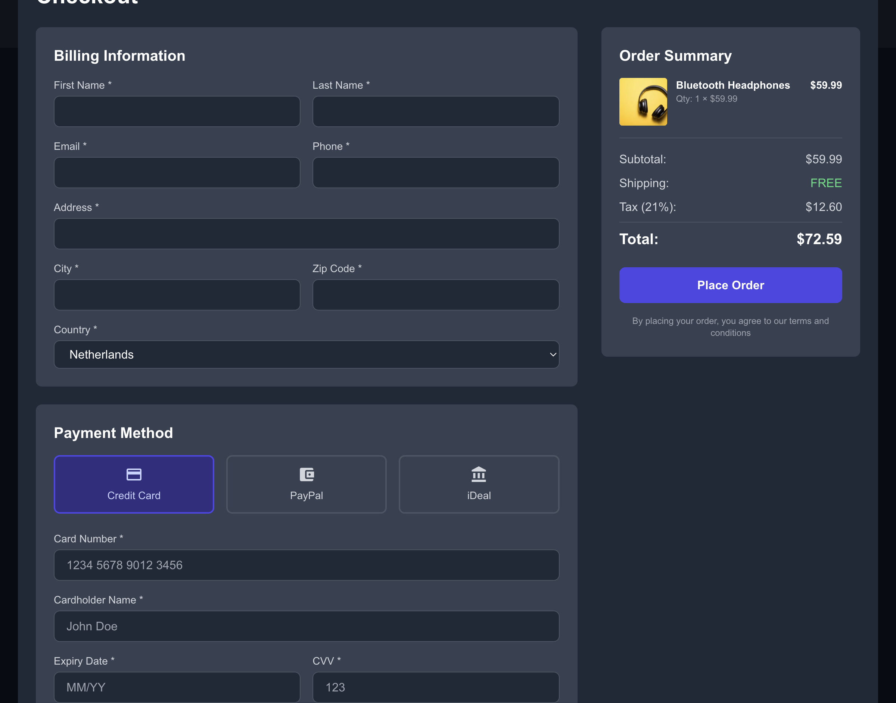
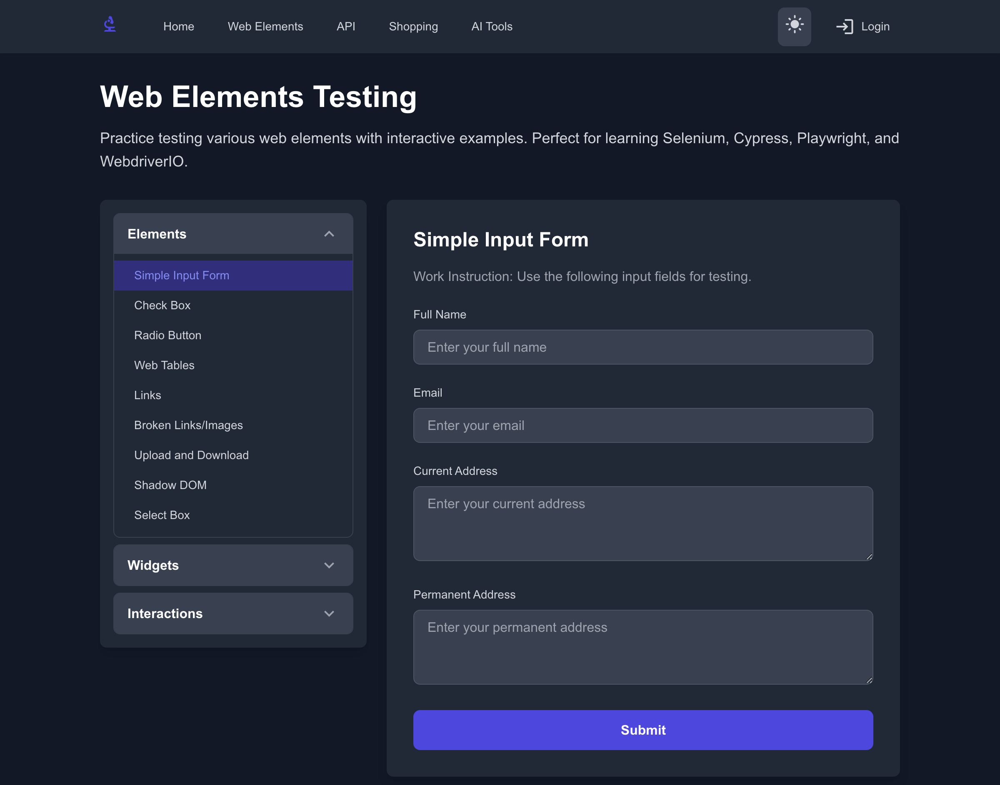

# Product Discovery: Practice Automated Testing

**URL:** https://practiceautomatedtesting.com
**Domain:** E-Commerce (Practice Site)
**Analysis Date:** 2026-01-03

## Table of Contents

1. [Executive Summary](#executive-summary)
2. [Process Flows](#process-flows)
3. [Discovered Features](#discovered-features)
4. [Page Inventory](#page-inventory)
5. [Risk Assessment](#risk-assessment)

---

## Executive Summary

- **Processes Analyzed:** 1
- **Pages Discovered:** 3
- **Features Found:** 18
- **Screenshots Captured:** 4

> **Key Discovery:** Checkout IS implemented! It opens as a modal when clicking the cart button. Previous analysis missed this because it didn't interact with the cart.

### Homepage

---

## Process Flows

The following user journeys were analyzed based on the e-commerce domain template:

### Purchase Product (CRITICAL)

*The complete journey from browsing to order confirmation*

**Status:** COMPLETED
**Steps Completed:** 5/8

| Step | Action | Status | URL/Location |
|------|--------|--------|--------------|
| Browse Products | Find products to purchase | ✅ found_via_url | /shopping |
| Select Product | Choose a product | ✅ found (product cards visible) | /shopping |
| Add to Cart | Add selected product | ✅ found_via_action | Cart updated to 1 item, $59.99 |
| View Cart | Open shopping cart | ✅ found (modal opens) | Cart modal with items |
| Checkout | Enter shipping/payment | ✅ found (in cart modal) | Modal includes full checkout form |
| Shipping Info | Enter address | ✅ found (form fields) | Address fields + country selector |
| Payment Info | Enter payment details | ✅ found (card fields) | Credit Card, PayPal, iDeal options |
| Place Order | Complete purchase | ❓ not tested | "Place Order" button present |

#### Screenshots

**Browse Products**

**Add to Cart**

**Checkout Modal**

---

## Discovered Features

### Shopping Features (CRITICAL)

| Feature | Element | Risk |
|---------|---------|------|
| Shopping Cart | Button showing item count and total | Critical |
| Add to Cart | Multiple "Add to Cart" buttons on product cards | Critical |
| Checkout Form | Modal with shipping and payment fields | Critical |
| Payment Methods | Credit Card, PayPal, iDeal options | Critical |
| Place Order | Submit button for completing purchase | Critical |

### Product Discovery (HIGH)

| Feature | Element | Risk |
|---------|---------|------|
| Product Search | Search input field | High |
| Category Filter | Dropdown: All, Electronics, Accessories, Office Supplies, Furniture | High |
| Price Range Filter | Min/Max price inputs ($14.99 - $199.99) | High |
| Rating Filter | Buttons: All, 3+, 4+, 5+ stars | High |

### Product Management (MEDIUM)

| Feature | Element | Risk |
|---------|---------|------|
| Sort by Name | Toggle button with ascending/descending | Medium |
| Sort by Price | Toggle button | Medium |
| In Stock Filter | Checkbox filter | Medium |
| On Sale Filter | Checkbox filter | Medium |
| Pagination | Page 1, Page 2, Next buttons | Medium |

### UI/UX Features (LOW)

| Feature | Element | Risk |
|---------|---------|------|
| Theme Toggle | Dark/Light mode switch | Low |
| Login Link | Navigation link (returns 404) | Low - Not Implemented |

---

## Page Inventory

### Homepage
**URL:** https://practiceautomatedtesting.com/
**Features:** Navigation to Shopping, Web Elements, API, AI Tools sections

### Shopping Page
**URL:** https://practiceautomatedtesting.com/shopping
**Features:** Product listing, filters, search, cart, checkout modal

### Web Elements Page
**URL:** https://practiceautomatedtesting.com/webelements
**Features:** Form inputs, checkboxes, radio buttons, tables, links, file upload, shadow DOM, select boxes

---

## Risk Assessment

**Total Features Assessed:** 18

| Risk Level | Count | Features |
|------------|-------|----------|
| 🔴 Critical | 5 | Cart, Add to Cart, Checkout, Payment, Place Order |
| 🟠 High | 4 | Search, Category Filter, Price Filter, Rating Filter |
| 🟡 Medium | 5 | Sorting, In Stock, On Sale, Pagination, Web Elements Forms |
| 🟢 Low | 4 | Theme Toggle, Login (N/A), Checkboxes, Radio Buttons |

### Key Findings

✅ **Checkout Flow EXISTS!** The checkout is implemented as a modal that opens when clicking the cart button. It includes:
- Shipping address form with country selector (Netherlands, Belgium, Germany, France, UK)
- Three payment methods: Credit Card, PayPal, iDeal
- Card details input fields
- Place Order button

⚠️ **Login Not Implemented:** The login link returns a 404 page. Skip authentication tests until implemented.

### Test Priority Recommendations

| Priority | Tests | Run When |
|----------|-------|----------|
| 1 - Critical | Add to cart, checkout flow, payment selection | Every deploy |
| 2 - High | Search, filters (category, price, rating) | Every PR |
| 3 - Medium | Sorting, pagination, combined filters | Nightly |
| 4 - Low | Theme toggle, web elements practice | Weekly |

---

*This document was automatically generated by the Regression Analyzer.*
*Use this document as input for the Planner agent to create a targeted test plan.*

**Next Step:** Run Planner agent with: "Create test plan using this product discovery document"
